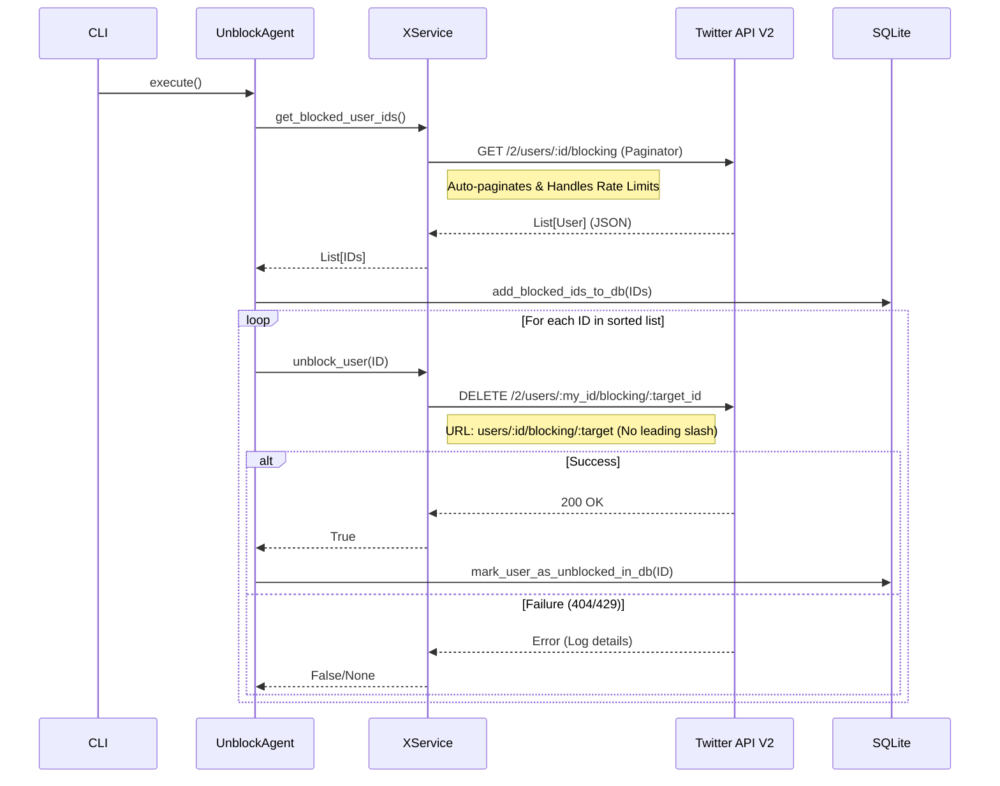

# X Agent Architecture Deep Dive

## System Overview

The `x-agent` is a modular CLI application designed to automate interactions with the X (Twitter) API. It uses a layered architecture to separate concerns:

1.  **CLI Layer (`cli.py`)**: Entry point. Parses arguments, configures logging, and instantiates the appropriate Agent.
2.  **Agent Layer (`agents/`)**: Implements business logic for specific tasks (e.g., `UnblockAgent`, `InsightsAgent`). Agents are resumable and state-aware.
3.  **Service Layer (`services/x_service.py`)**: Encapsulates API complexity. Handles authentication, rate limiting, pagination, and error handling. Abstractions over `tweepy`.
4.  **Persistence Layer (`database.py`)**: SQLite database for tracking state (e.g., which IDs have been processed), ensuring resumability.

## Architecture Diagram (Mermaid)

```mermaid
graph TD
    subgraph Local Environment
        User[User / CLI] -->|Run Command| CLI[cli.py]
        CLI -->|Instantiate| Service[XService]
        CLI -->|Instantiate| Agent[UnblockAgent]
        
        Agent -->|Use| Service
        Agent -->|Read/Write| DB[(SQLite Database)]
        
        subgraph "XService Logic"
            Service -->|Auth (OAuth 1.0a)| Auth[Authentication]
            Service -->|Rate Limit| RL[Rate Limit Handler]
            Service -->|Fetch| GetBlocked[get_blocked_user_ids]
            Service -->|Action| Unblock[unblock_user]
        end
    end

    subgraph "X (Twitter) API"
        GetBlocked -->|GET /2/users/:id/blocking| API_Get[API V2: Get Blocked]
        Unblock -->|DELETE /2/users/:id/blocking/:target_id| API_Del[API V2: Unblock]
    end

    API_Get -->|Return User Objects| GetBlocked
    API_Del -->|Return 200 or 404| Unblock
```

## Unblock Logic Flow

The following sequence diagram illustrates the detailed interaction for the Unblock Agent, highlighting the API version usage and state management.



## Current Issue Deep Dive: The "Ghost Block" Paradox

The current issue involves a discrepancy where the API returns a user as "Blocked" but refuses to "Unblock" them.

### Flow Trace
1.  **Fetch**: `UnblockAgent` calls `XService.get_blocked_user_ids()`.
2.  **API Call**: `XService` uses `tweepy.Paginator(client_v2.get_blocked)`.
    *   **Result**: The API returns a list of `User` objects (e.g., ID `1407714921828306951`).
    *   *Implication*: These users definitely exist and are blocked according to the V2 Read endpoint.
3.  **Unblock**: `UnblockAgent` iterates and calls `XService.unblock_user(1407714921828306951)`.
4.  **API Call**: `XService` executes `DELETE /2/users/{me}/blocking/1407714921828306951`.
5.  **Result**: `404 Not Found`.

### Root Cause Analysis (Resolved)

The `404 Not Found` errors were caused by incorrect URL construction in the manual V2 request.
*   **Incorrect:** `/2/users/...` (Double version prefix if base is `/2`) or `/users/...` (Absolute path dropping base).
*   **Correct:** `users/...` (Relative path appending to base `/2`).
*   **Code Defect:** An indentation error nested `unblock_user` inside `get_blocked_user_ids`, preventing external calls (detected via tests).

This has been resolved by correcting the URL format and method visibility.